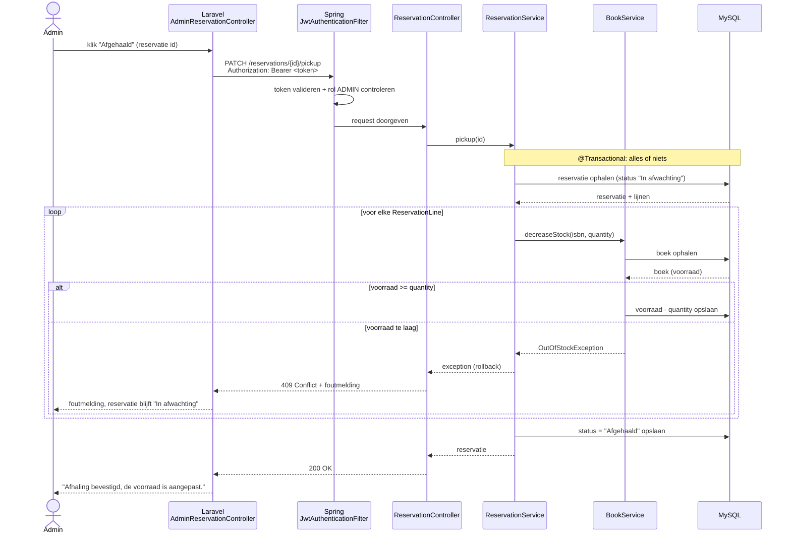

# Sequentiediagram: admin bevestigt ophaling

```mermaid
sequenceDiagram
    actor Admin
    participant L as Laravel<br/>AdminReservationController
    participant F as Spring<br/>JwtAuthenticationFilter
    participant RC as ReservationController
    participant RS as ReservationService
    participant BS as BookService
    participant DB as MySQL

    Admin->>L: klik "Afgehaald" (reservatie id)
    L->>F: PATCH /reservations/{id}/pickup<br/>Authorization: Bearer <token>
    F->>F: token valideren + rol ADMIN controleren
    F->>RC: request doorgeven
    RC->>RS: pickup(id)
    Note over RS,DB: @Transactional: alles of niets
    RS->>DB: reservatie ophalen (status "In afwachting")
    DB-->>RS: reservatie + lijnen
    loop voor elke ReservationLine
        RS->>BS: decreaseStock(isbn, quantity)
        BS->>DB: boek ophalen
        DB-->>BS: boek (voorraad)
        alt voorraad >= quantity
            BS->>DB: voorraad - quantity opslaan
        else voorraad te laag
            BS-->>RS: OutOfStockException
            RS-->>RC: exception (rollback)
            RC-->>L: 409 Conflict + foutmelding
            L-->>Admin: foutmelding, reservatie blijft "In afwachting"
        end
    end
    RS->>DB: status = "Afgehaald" opslaan
    RS-->>RC: reservatie
    RC-->>L: 200 OK
    L-->>Admin: "Afhaling bevestigd, de voorraad is aangepast."
```
